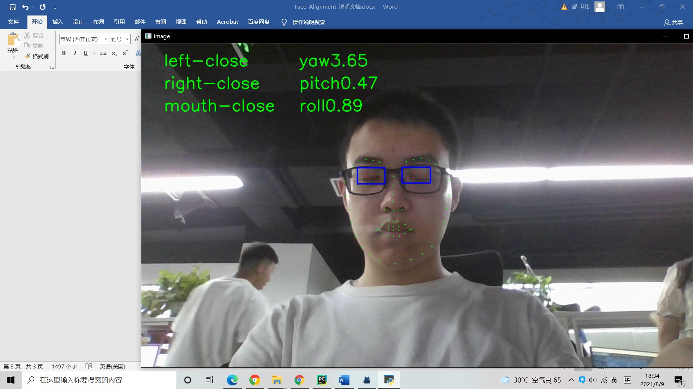

# Internship_project_display
A display for my internship projects in Dreamdeck Co., LTD, with part of the scripts.

Part 1:Face Alignment:
Code:
1) demo_webcam_smooth.py: Webcam script with a blink detection model. Modified from https://github.com/cleardusk/3DDFA_V2
2) collector.py: Used to construct the eye-blink dataset
3) my_train.py: Train an eye-blink detection model on the eye-blink dataset. Modified from https://github.com/4uiiurz1/pytorch-res2net
 

 
Part 2:Hand Detection
Code:
1) gesture_2D.py & gesture_3D.py: Calculate the bending degree of the finger and judge the gesture through the angle between the two-dimensional and three-dimensional coordinates, and send it to the socket server. Modified from https://google.github.io/mediapipe/solutions/hands
2) gesture_weapon.cs & gesture_bullet.cs: Those C# scripts mounted on the characters in the Unity project are responsible for serving as the server side of the socket, receiving the gesture status information sent by the python client, and firing bullets of different sizes.
 

 
Part 3:Semantic Segmentation
Code:
1) u2net_video_seg.py & u2net_video_seg_mp.py: Script for semantic segmentation of webcam. Modified from https://github.com/xuebinqin/U-2-Net
 
 
